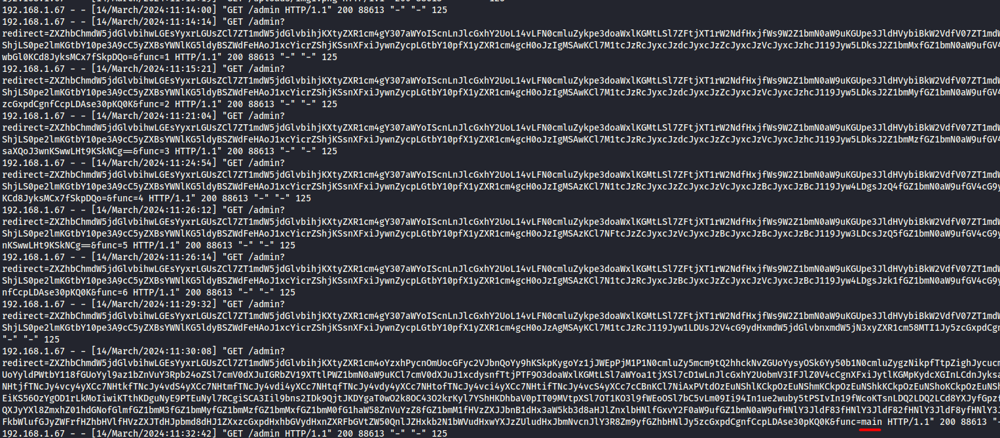
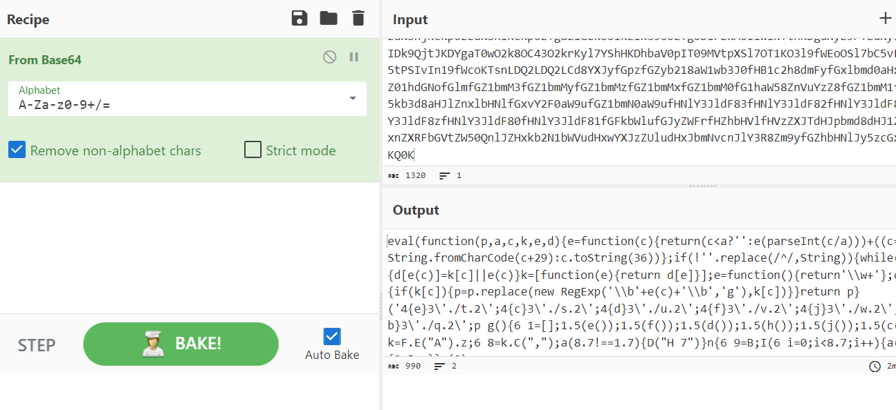
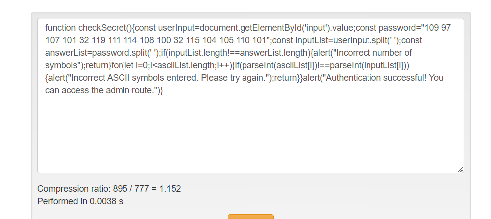
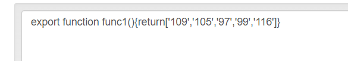
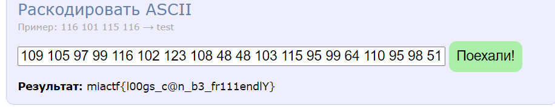

# Loghunter | Medium | Forensics

## Информация

> Агент, кто-то тестировал наш сайт на проникновение без нашего спроса. Пожалуйста, займись этим. Файл логов прикладываю.

## Деплой

нет

## Выдать участинкам

Файл logs.txt

## Описание

Для начала стоит открыть файл logs.txt, т.к. это единственное, что нам дано. Некоторое время изучаем строчки сайта, выглядит так, будто его пентестят (не слишком навязчиво, но все же). Видим регистрацию юзера, попытки эксплуатации некоторых язв, а также загрузку какой-то картинки, после которой получается использовать панель админа. Если уточнять, то скорее всего, хакер воспользовался этим -> https://www.metabaseq.com/imagemagick-zero-days/. Тем не менее, это не так важно, ведь далее мы видим множество base64 строчек. Они все передаются с параметром func, которое имеет значение, как цифровое, так и текстовое. Логично начать с того, что называется main.

Используем любой декодер, к примеру CyberChef.

Весь js выглядит очень грязно, т.к. кажется, его обфусцировали, чтобы усложнить нам чтение. Ищем декодер, который справляется с этим вместо нас, ведь делать это вручную очень тяжело и не продуктивно.

Тут есть какие-то числа, очень уж они похожи на ASCII, но пока оставим на потом. Давайте попробуем раскодировать функцию, идущую первой по порядку. 

Кажется надо проделать тоже самое с каждой последующей функцией. Составляем массив чисел, в соотетсвии с тем, когда main функция вызывает каждую из функций. 

Выходит такой массив: 109 105 97 99 116 102 123 108 48 48 103 115 95 99 64 110 95 98 51 95 102 114 49 49 49 101 110 100 108 89 125

Декодируем с помощью python, js, онлайн декодера и тд.

Выходит такой ответ. Он и является флагом. 

## Решение

Можно также написать сплойт для решения, который красиво извлечет весь base64 и раздекодит его в соответсвии с номером функции, но можно сделать это и руками.

## Флаг

`miactf{l00gs_c@n_b3_fr111endlY}`

