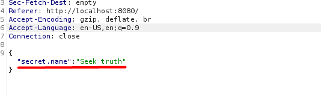

# Sorority | Hard | Web

## Информация

> Специальные службы передали информацию о том, что существует секретное братство, которое занимается контрразветкой в нашу сторону. Спустя месяца работы над поиском хоть какой-то зацепки, мы нашли архив их сайта. Тем не менее, уязвимости в нем мы так и не нашли, кажется они все исправили, но наша надежда не угасает. Агент, пожалуйста, найди узявимость в сайте и покончи с этими сектантами. 
>
> http://<ip>:8080

## Деплой

```sh
docker-compose -f docker-compose.yml up --build -d
docker-compose up --build
(запускать надо из папки с докер файлами)
```

## Выдать участинкам

Все что лежит в папке [public/](public/) и IP:PORT сервиса. Если будет тяжело решаться, также можно приложить докерфайлы, т.к. они сами по себе могут немного палить вектор атаки.

## Описание
В задание четко дается понять, что присутствует уязвимость, а также даны сорцы. Надо перейти к их изучению, но еще и параллельно открываем сам сайт. Замечаем, что здесь только одна форма, а еще нас просят передать секретное слово, теперь точно идем смотреть код. Внимание привлекает routes/index.js, именно там происходит проверка секретной фразы. Запоминаем какие фрэймворки используются, это может пригодиться. Смотрим на функцию валидации нашего ввода. Есть регекс, но он нас не пугает, ведь он очень легко читаемый, а также уязвимвый, т.к. все что он делает - это проверяет на вхождение перечисленные в нем знаки. Также видим, что введенный нами секрет должен соответствовать фразе "Seek truth". Тем не менее, это не все. Присутствует шаблонизатор pug.compile(smth), начинаем гуглить информацию и замечаем различные сплойты и уязвимости сервер сайда, RCE всякие, а это как раз то, что нам нужно.


Теперь соединяем всю информацию воедино:
1) Сервер сайд у сайта на NodeJS, он использует узявимый шаблонизатор pug.
2) Ввод проверяется регексом, т.е. это может быть потенциальной дырой.
3) Единственное что привлекает внимание среди всего кода - форма.
4) Есть закоменченная строка, которая тоже наталкивает на вектор атаки. 


Изучаем все статьи по pug'у более тщательно, кажется, его используют в Prototype Pollution. Возникает вопрос, а как эта уязвимость связана с server side, это же в большинстве своем client side? Здесь нужно более детально изучить сам момент передачи данных и как язык все это обрабатывает. Не забываем что JS это язык ООП, в котором каждый объект имеет ключевое слово prototype, помогающее в алгоритме наследования. Именно эта язва способствует изменению логики приложения. Наследственость - это такое являние, когда дочерений объект имеет свойство, полученное от своего родителя. В JS множество элементов могут иметь одно и то же свойство от родителя. Ключевым моментом является то, что вся логика "прототипности" может помешать, ведь имея доступ к тому, чтобы изменитить глобальный прототип (свойство) у одного объекта, оно может измениться и у всех его детей.


Хорошо, с прототипами понятно, а как же все-таки перенести все в server side? Ну и здесь не обошлось без логики самих языков и их парсеров (обработчиков). AST - именно то, что помогает нам в использовании уязвимости. Абстрактное синтаксическое дерево - структура различных инструкций и логических элементов, представленная в виде JSON объекта, позволяющая удобно проверять программные конструкции, а также корректность элементов. Теперь, когда есть понимание того, что это, понятно почему именно шаблонизаторы используют AST, ведь именно они отвечают за рендеринг и выполнение различных действий.


Выходит, что если мы направим новую логику нашего ввода, то объект, чье свойство было подвержено изменению, запишется внутрь AST, а далее будет обработано шаблонизатором и исполнено на сервере. Т.е. наш ввод -> узвимый метод pug -> генерация AST логики кода уже с измененным прототипом -> исполнение переданных данных через шаблонизатор за счет функции compile -> исполнение производного кода 


Чтобы решить таск, надо отправить фразу "Seek truth", т.к. только она позволит исполнится шаблонизатору.


Перехватываем запрос через Burp и видим, что данные действительно передаются в JSON'е. А значит, пора менять его логику и структуру. 




Ищем различные пэйлоады и сначала эксплуатируем Prototype Pollution, при этом параллельно добавляя свойства (логические блоки) AST, в одном из которых идет исполнение команды. Для того, чтобы исполнить желаемый код, обращаемся к документации того, как работает метод compile.


Методом проб и ошибок отслыаем разные пэйлоады. Главным шагом на этом этапе является выпадение ошибки, для этого требуется запускать команду в оболочке $(smth), иначе ничего выводится не будет (своеобразная подстановка). Начинаем замечать, что время от времени выпадает ошибка, значит движемся правильно. В конечном итоге с помощью исполнения команд по типу ls, видим, что пэйлоад отрабатывается. Находи флаг и считваем файл cat/head или другими командами вывода. Таск решен. 


## Решение

Можно также написать сплойт для решения, но оно также решается и бурпом.

## Флаг

`miactf{s33k_flaGGG_n0t_truth}`

